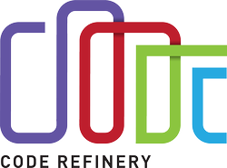

# Tools and resources

Useful bioinformatics tools and resources for you. 
 

# Tools and Pipelines

::: {layout-ncol=2}
[{.class width=50%}](https://nf-co.re/)

 
[Nf-core](https://nf-co.re/) - Portable, documented and easy to use workflows based on nextflow. 

  
[{.class width=50%}](https://git-scm.com/)

  
[Git](https://git-scm.com/) - a free and open source distributed version control system designed to handle everything from small to very large projects with speed and efficiency. 

:::

  

# Training Resources

 

::: {layout-ncol=2}
[{.class width=50%}](https://software-carpentry.org/)

 
[Software Carprentries](https://software-carpentry.org/) - teaching basic coding skills for research computing to researchers worldwide.

   
[{.class width=50%}](https://elixir-europe.org/)

   
[Elixir](https://elixir-europe.org/) - brings together life science resources from across Europe, including databases, software tools, training materials, cloud storage and supercomputers. 

  
[{.class width=50%}](https://coderefinery.org/)

   
[Code Refinery](https://coderefinery.org/) - teaching all the essential tools so everyone can make full use of software, computing, and data.

:::

  

# Computing Resources

 

::: {layout-ncol=2}
[{.class width=50%}](https://www.slubi.se)

 
[SLUBI computing resources](https://www.slubi.se/) - we have local computing resources at all campuses and strive to coordinate the management of these.

   
[{.class width=70%}](https://www.naiss.se/)

 
[National Academic Infrastructure for Supercomputing in Sweden](https://www.naiss.se/) - organization for high-performance computing, storage, and data services for academic users in Sweden. 

  
[{.class width=90%}](https://www.uppmax.uu.se/)

 
[UPPMAX](https://www.uppmax.uu.se/) - Uppsala Multidisciplinary Center for Advanced Computational Science, HPC computing rescource for Swedish scientists. Apply for free computing projects via [NAISS](https://www.uppmax.uu.se/support/getting-started/applying-for-a-user-account/).

[{.class width=90%}](https://azure.microsoft.com/de-de/)

  
[Microsoft Azure](https://azure.microsoft.com/de-de/) - SLU has an agreement with Microsoft Azure for cloud computing (including price discounts). You can get more information by contacting the SLU IT-support.
:::

# SLU support
  

::: {layout-ncol=2}
[{.class width=60%}](https://www.slu.se/en/Collaborative-Centres-and-Projects/centreforstatistics/)

 
[Center for Statistics](https://www.slu.se/en/Collaborative-Centres-and-Projects/centreforstatistics/) -  a joint platform for statisticians at SLU to enable exchange of knowledge and to be a resource for the entire university by organizing workshops and providing statistical advice and support for all employees at SLU. 

[{.class width=60%}](https://www.slu.se/en/subweb/library/publish-and-analyse/archiving-and-publishing-research-data/)

 
[Data Management Support](https://www.slu.se/en/subweb/library/publish-and-analyse/archiving-and-publishing-research-data/) -  assists SLU employees with data management - from planning, including data management plans, to publishing, long-term preservation, archiving and the reuse of research and environmental assessment data. 

 
[{.class width=60%}](https://www.upsc.se/platforms/upsc-bioinformatics-facility.html)

 
[UPSC Bioinformatics Facility](https://www.upsc.se/platforms/upsc-bioinformatics-facility.html) - centralises bioinformatics competences in Umeå, offering a range of bioinformatics services as well as local bioinformatics training, international workshops and training programs.

:::

# Sequencing Resources

::: {layout-ncol=2}
  
[{.class width=80%}](https://ngisweden.scilifelab.se/)

 
[National Genomics Infrastructure](https://ngisweden.scilifelab.se/) -   NGI Uppsala offers next generation sequencing (NGS) and genotyping services of high quality using the latest technologies to academic researchers in Sweden and abroad.

  
[{.class width=80%}](https://www.medsci.uu.se/snpseq_technology_platfom/)

 
[SNP&SEQ](https://www.medsci.uu.se/snpseq_technology_platfom/) - Part of NGI Sweden, hosted by SciLifeLab, offers genotyping and next generation sequencing services to academic researchers in Sweden.

  
[{.class width=80%}](https://www.ugc.igp.uu.se/our-services/sequencing/)

 
[Uppsala Genome Center](https://www.ugc.igp.uu.se/our-services/sequencing/) - Part of NGI Sweden, hosted by SciLifeLab, provides long read sequencing services, from i.e. PacBio, Ion, Oxford Nanopore.

:::
