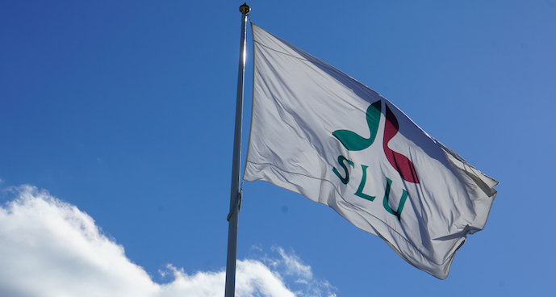
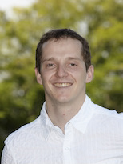
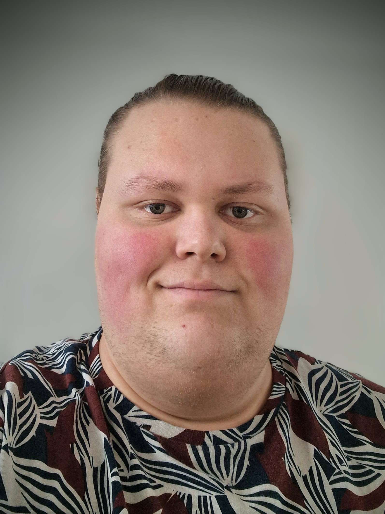

# SLUBI
SLU's Bioinformatics Infrastructure

# Our goal

Our goal is to provide support and training in bioinformatics for SLU staff, and to build a strong community of bioinformaticians within SLU. Our staff is located on the 3 SLU campuses in Ultuna, Umeå and Alnarp. We want to join forces and coordinate teaching activities, common resources (hardware, software).

We also serve as a link to the broader bioinformatics community in Sweden, such as the [National Bioinformatics Infrastructure Sweden, NBIS](https://nbis.se/), facilitating collaboration and knowledge exchange.

{ width="45%" .slubi-centered }

# Our team

We are a group of skilled bioinformaticians. Please klick on us to see more about our background.

-   [{ width="50%" .slubi-avatar }](amrei.md)

    **[Amrei Binzer-Panchal, bioinformatician in Ultuna (VH faculty)](amrei.md)**: head of the infrastructure, and expert in analysing RNAseq, methylation data, microarrays, and 10x single cell RNAseq data.

-   [{ width="50%" .slubi-avatar }](nicolas.md)

    **[Nicolas Delhomme, bioinformatician in Umeå (S faculty)](nicolas.md)**: head of the [UPSC Bioinformatics Facility](https://www.upsc.se/platforms/upsc-bioinformatics-facility.html), expert in expression profiling and anything bioinformatics related.

-   [{ width="50%" .slubi-avatar }](lizel.md)

    **[Lizel Potgieter, bioinformatician in Alnarp (LTV faculty)](lizel.md)**: our plant breeding, comparative genomics, population genomics, variant calling, genome assembly and annotation expert.

-   [{ width="50%" .slubi-avatar }](adnan.md)

    **[Adnan Niazi, bioinformatician in Ultuna (VH faculty)](adnan.md)**: our expert in RNAseq, metabarcoding (16S/18S/ITS), epigenomics (WGBS/RRBS), genome assembly and annotation.

-   [{ width="50%" .slubi-avatar }](abu.md)

    **[Abu Bakar Siddique, bioinformatician in Ultuna (NJ faculty)](abu.md)**: our expert in metagenomics, DNASeq, shotgun seq, metabarcoding (ITS), WGS analysis, read mapping, genome assembly and annotation. With wetlab experience in DNA, PCR and HTS library prep.

-   [{ width="50%" .slubi-avatar }](renaud.md)

    **[Renaud Van Damme, system administrator and bioinformatician (VH faculty)](renaud.md)**: our system administrator for the local High Performance Computing cluster, pipeline developer and expert in metagenomics.

